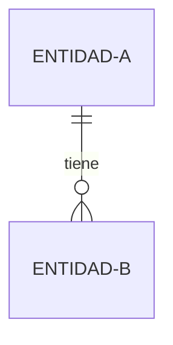

# Modelo de datos y diccionario   ·   `[CAPA 3]`

**Para qué sirve este documento.** Es el mapa de los datos del sistema: qué entidades existen, cómo se relacionan y qué significa cada campo. Sin él, cada quien deduce el modelo leyendo migraciones, y el significado de un campo termina viviendo en la memoria de quien lo creó.

> Plantilla. Acompaña a la estación 06 (especificación) y **madura con el sistema**: cada fase que toque el esquema actualiza acá su parte, en la misma fase ([`03·D2`](../../base/03-datos.md)). Si el proyecto no tiene base de datos, el documento existe igual y dice: «No aplica porque «el porqué»». Reemplaza los `«…»` y borra esta caja.

## 1. El mapa de entidades

> El dibujo general: qué se conecta con qué. Con Mermaid se mantiene como texto; un dibujo que no se puede editar envejece solo.

## 2. Las entidades

> Una fila por entidad, con su propósito en lenguaje del negocio: qué representa, no cómo se guarda.

| Entidad | Qué representa | Módulo dueño |
|---|---|---|
| «…» | «…» | «…» |

## 3. Diccionario de datos

> Un bloque por entidad. La columna «regla» lleva lo que el sistema exige del campo (obligatorio, único, rango, catálogo); es lo que las validaciones implementan y las pruebas comprueban.

### «Entidad»

| Campo | Tipo | Regla | Qué significa |
|---|---|---|---|
| «…» | «…» | «…» | «…» |

## 4. Relaciones y cardinalidades

| Relación | Cardinalidad | Qué pasa al borrar |
|---|---|---|
| «A → B» | «1 a muchos» | «se restringe / se propaga / queda huérfano y por qué se acepta» |

## 5. Decisiones del modelo

> Las que alguien va a cuestionar en seis meses: por qué se desnormalizó algo, por qué un catálogo y no un campo libre, por qué se guarda histórico de un valor. Cada una con su alternativa descartada.

| Decisión | Alternativa descartada | Por qué |
|---|---|---|
| «…» | «…» | «…» |

## 6. Lo que se calcula, y por eso no se guarda

> **Un dato guardado que también se puede calcular es una segunda verdad, y envejece.** El estado que sale de leer otros datos se calcula al pedirlo; si hay que guardarlo por velocidad, se dice que es un índice y de dónde se rehace.

| Dato | De dónde sale | ¿Se guarda? |
|---|---|---|
| «…» | «Qué se lee para calcularlo» | «No, se calcula · Sí, como índice que se rehace desde «…»» |

## 7. Lo que este modelo deja fuera a propósito

> Lo que alguien va a buscar acá y no está. Escribirlo evita que la próxima persona lo agregue creyendo que se olvidó.

- **«Qué queda fuera».** «Por qué, y qué habría que cambiar para que entrara.»
