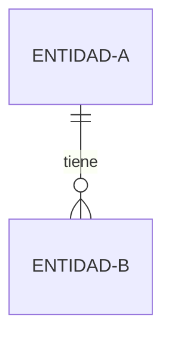

# Modelo de datos y diccionario   ·   `[CAPA 3]`

**Para qué sirve este documento.** Es el mapa de los datos del sistema: qué entidades existen, cómo se relacionan y qué significa cada campo. Sin él, cada quien deduce el modelo leyendo migraciones, y el significado de un campo termina viviendo en la memoria de quien lo creó.

> Todo documento creado con esta plantilla se redacta aplicando estas reglas. Esta nota se borra al llenarla.
>
> | Regla | Qué exige |
> |---|---|
> | [`00·ID8`](../../base/00-identidad-y-rol/reglas/ID8-escribe-sin-las-marcas-que-delatan-generacion-automatica.md) | Escribir sin las marcas que delatan generación automática |
> | [`00·ID9`](../../base/00-identidad-y-rol/reglas/ID9-di-lo-mismo-en-menos-palabras.md) | Decir lo mismo en menos palabras |
> | [`00·ID11`](../../base/00-identidad-y-rol/reglas/ID11-el-agente-agrega-informacion-irrelevante-al-asunto.md) | Escribir solo lo pertinente al asunto |
> | [`00·ID12`](../../base/00-identidad-y-rol/reglas/ID12-el-agente-no-conserva-el-espanol-colombiano.md) | Seguir la norma del español de Colombia, si el proyecto la declara |

> Plantilla del modelo de datos. Acompaña a la estación 06 (especificación) y madura con el sistema: cada fase que toque el esquema actualiza aquí su parte, en la misma fase ([`03·D2`](../../base/03-datos.md)). Si el proyecto no tiene base de datos, el documento existe igual y dice: «No aplica porque «el porqué»».
>
> Al llenarla se reemplazan los `«…»` y se borran todas las notas como esta. El párrafo «Para qué sirve este documento» se queda.

## 1. El mapa de entidades

> Es el dibujo general de qué entidad se conecta con cuál. Va en Mermaid para mantenerlo como texto: un dibujo que no se puede editar envejece solo.

```mermaid
erDiagram
    ENTIDAD-A ||--o{ ENTIDAD-B : "tiene"
```

## 2. Las entidades

> Lista las entidades del sistema, una por fila, con lo que representa cada una en lenguaje del negocio, no cómo se guarda.

| Entidad | Qué representa | Módulo dueño |
|---|---|---|
| «…» | «…» | «…» |

## 3. Diccionario de datos

> Describe cada campo de cada entidad, un bloque por entidad. La columna Regla lleva lo que el sistema exige del campo (obligatorio, único, rango, catálogo): es lo que las validaciones implementan y las pruebas comprueban.

### «Entidad»

> Agrupa los campos de una entidad, con su tipo, su regla y su significado.

| Campo | Tipo | Regla | Qué significa |
|---|---|---|---|
| «…» | «…» | «…» | «…» |

## 4. Relaciones y cardinalidades

> Dice cómo se relacionan las entidades, cuántos registros de cada lado y qué pasa con los relacionados cuando se borra uno.

| Relación | Cardinalidad | Qué pasa al borrar |
|---|---|---|
| «A → B» | «1 a muchos» | «se restringe / se propaga / queda huérfano y por qué se acepta» |

## 5. Decisiones del modelo

> Registra las decisiones que alguien va a cuestionar en seis meses, como por qué se desnormalizó algo, por qué un catálogo y no un campo libre o por qué se guarda el histórico de un valor.

| Decisión | Alternativa descartada | Por qué |
|---|---|---|
| «…» | «…» | «…» |

## 6. Lo que se calcula, y por eso no se guarda

> Lista los datos que se calculan al pedirlos en vez de guardarse. Un dato guardado que también se puede calcular es una segunda verdad, y envejece; si hay que guardarlo por velocidad, se dice que es un índice y de dónde se rehace.

| Dato | De dónde sale | ¿Se guarda? |
|---|---|---|
| «…» | «Qué se lee para calcularlo» | «No, se calcula · Sí, como índice que se rehace desde «…»» |

## 7. Lo que este modelo deja fuera a propósito

> Es lo que alguien va a buscar aquí y no está, porque se dejó fuera a propósito. Escribirlo evita que la próxima persona lo agregue creyendo que se olvidó. Si no hay nada, se escribe «Ninguno».

- **«Qué queda fuera».** «Por qué, y qué habría que cambiar para que entrara.»
